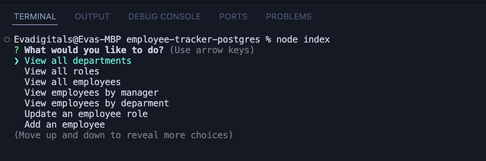
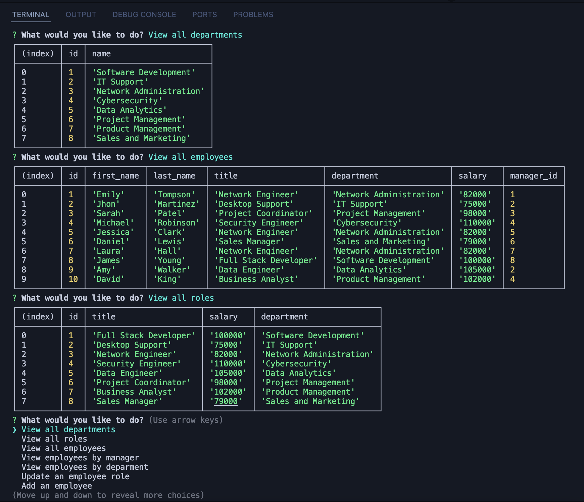

# employee-tracker-postgres
## Description
* Employee Tracker is a command-line application that allows a business to manage its employees, roles, and departments. It provides a variety of functionalities to view, add, update, and delete employees, roles, and departments within a company's database.

## Installation
* Install npm packages by running this code in the terminal ``` npm install ```
* Set up the database by runnning this code in the terminal ``` psql -U postgres ``` and enter postgres password
* Run schema and seeds sql files by running these codes in the terminal ``` \i schema.sql ``` and ``` \i seeds.sql ```

## Usage 
* To start the application run this code in the terminal ``` node index.js ```
* The application will present a menu with various options.
* Use the arrow keys to navigate and press ``` Enter ``` to select an option.

## Application Page
* 
* 

## Links
* [Github Repository](https://github.com/veyselarslan12/employee-tracker-postgres)
* [Example Test Video Link](https://drive.google.com/file/d/1q1IQt7JwajPLxfv7_oqf1HygvH4aRwSc/view)
